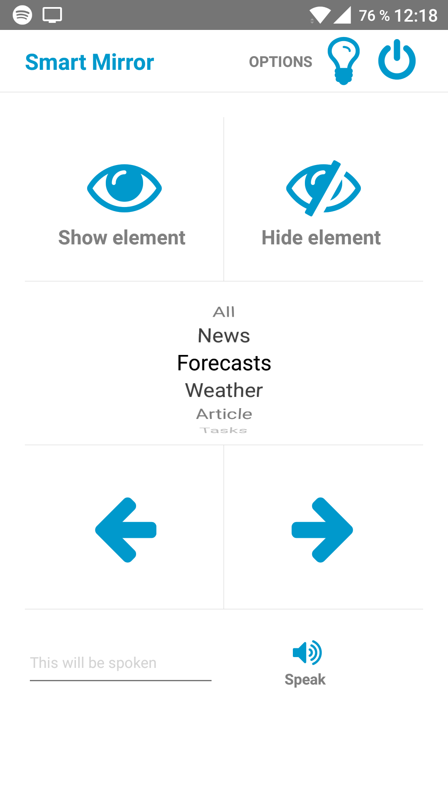
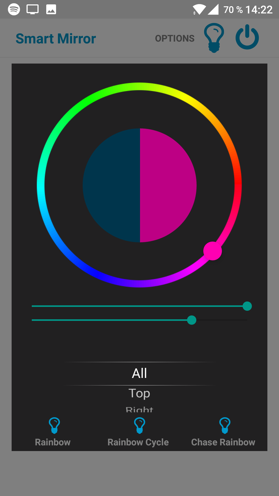

# OneAppToRuleThemAll

An app that controls and monitors my home and my life.

##Demo

Click to play! (Will open YouTube)
[](http://www.youtube.com/watch?v=O_si4gOGGao "Video Title")

Now supports controlling my [Magic Mirror](https://github.com/jakkra/SmartMirror) also:

 


## Getting Started

The app uses my backend https://github.com/jakkra/OneBackendToRuleThemAll, which is hosted on Heroku. You can run your own server instance, in that case you need to edit the url in the constants file.

### Prerequisities

The app consists of four parts:
- Reminder
- Temperature graphs
- Philips Hue Lights controller
- Intruder alert and motion logging

Without Philips Hue and/or some kind of data source in your home, it is only an app that does reminders.

My current implementation lets you control your Hue lights from outside of your network from any device, using the backend.

So to have full functionality you want some kind of data source (temperatures and motion detection). I have a Raspberry Pi with two connected thermometers and a PIR motion sensor (infrared) which supply my backend with data via a simple Python script.

### Installing

Firstly install React Native: https://facebook.github.io/react-native/docs/getting-started.html#content

```
git clone https://github.com/jakkra/OneAppToRuleThemAll.git
cd OneAppToRuleThemAll
npm install
react-native run-android
```

### Configuration

This server can control your lights from outside of your home network. This is not officially supported yet by Philips (it's coming).
So since I'm using the unofficial Philips Hue Remote API, it requires some configuration.
For full description look at http://blog.paulshi.me/technical/2013/11/27/Philips-Hue-Remote-API-Explained.html

On your phone:
- Go to https://my.meethue.com/en-us/my-devices -> Login -> Settings -> MyBridge -> More Bridge Details
- Copy ID and paste it into the settings in the app.
- Go to ```www.meethue.com/en-US/api/gettoken?devicename=iPhone+5&appid=hueapp&deviceid=**BRIDGEID**``` and log in.
- Click 'yes' when it asks you if you trust the application
- Right click/long press on the 'Back to app' button and select copy url/address or similar.
- It looks like this ```phhueapp://sdk/login/**ACCESSTOKEN**```
- Copy the accessToken into the settings in the app.
- Profit!

React-Native didn't have any bridge for Androids Geo Fences, so I'm using IFTTT to automatically update the server if I'm at home or not.
Otherwise you must do it manually or the server will send you motion detection notifications which was falsely triggered by you.

This is the IFTTT channel to use: https://ifttt.com/maker (you need two instances, one for entering an area and one for leaving it)
This is the setup I have: http://imgur.com/a/JKhsP

You can do this on multiple phones, if you aren't alone in your household.

The token attribute can be found in the app under Settings, there you can copy it to the clipboard.


## License

This project is licensed under the MIT License - see the [LICENSE](LICENSE) file for details
